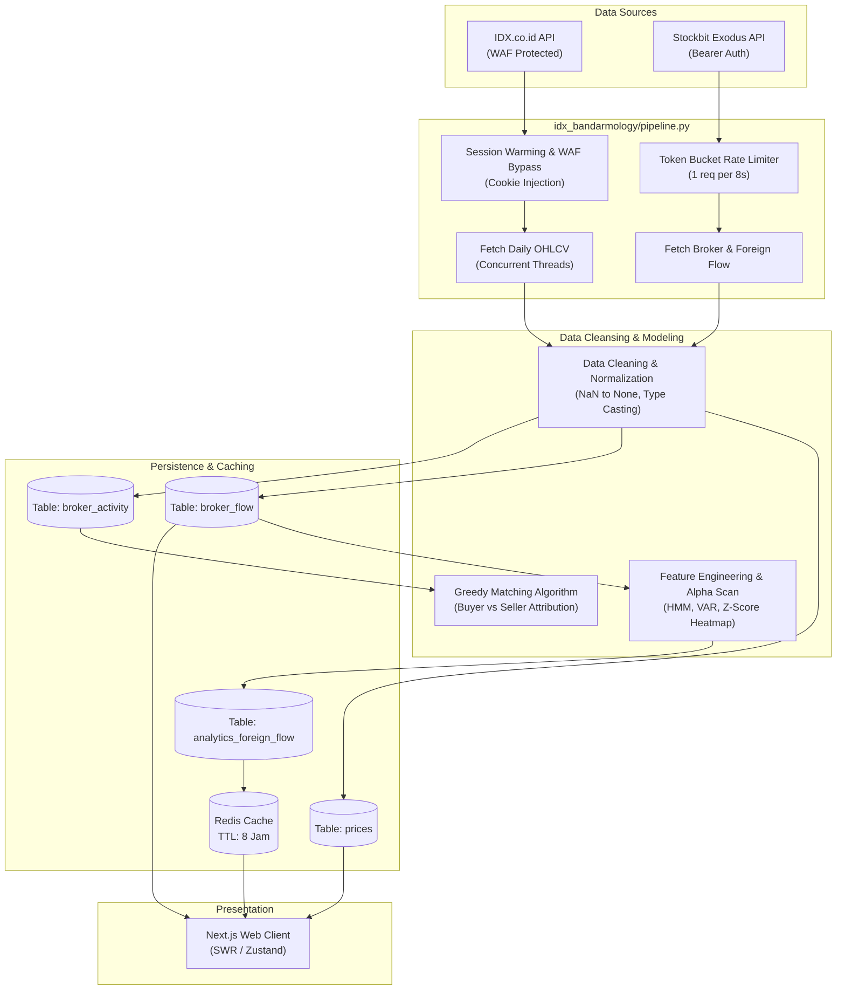

# DOKUMENTASI & ANALISIS ARSITEKTUR RE-TRACKER (THE INVESTOWL)

Dokumen ini menyajikan hasil analisis mendalam, pemetaan struktur, audit dependensi, reverse engineering alur kerja, dan tinjauan teknis (*code review*) menyeluruh untuk repositori **Re-Tracker** (The Investowl / SM Tracker).

---

## 1. STRUKTUR REPOSITORY

### A. Hierarki Folder (*Tree View*)

```text
Re-Tracker/
├── .github/
│   └── workflows/
│       └── backend-ci.yml                 # CI Pipeline pengujian backend (GitHub Actions)
├── .gitignore                             # Git ignore global
├── LICENSE                                # Lisensi repositori (MIT)
├── readme.md                              # Dokumentasi umum proyek
├── ANALISIS_ARSITEKTUR.md                 # Dokumen analisis sistem & arsitektur
│
├── app/                                   # [ARTEFAK USANG] Duplikat direktori Next.js lawas
│   ├── login/page.tsx
│   └── pending/page.tsx
│
├── backend/                               # Layanan Backend Kuantitatif (Python 3.11 / FastAPI)
│   ├── app/                               # Sub-modul bridge & router bandarmologi
│   │   ├── idx_bridge.py                  # Jembatan re-export paket idx_bandarmology
│   │   └── routers/
│   │       └── bandarmology.py            # Controller analitik bandarmologi (1.699 baris)
│   ├── idx_bandarmology/                  # Core Quantitative & Ingestion Engine
│   │   ├── __init__.py
│   │   ├── analysis.py                    # Klasifikasi profil broker & kalkulasi korelasi
│   │   ├── broker_api.py                  # Klien API Stockbit Exodus (Token Bucket Rate Limiter)
│   │   ├── config.py                      # Konfigurasi DB & paths khusus modul bandarmologi
│   │   ├── features.py                    # Feature engineering & kompilasi tabel feature
│   │   ├── init_universe.py               # Bootstrap universe saham IDX
│   │   ├── modeling.py                    # Pemodelan regresi OLS & klasifikasi return
│   │   ├── pipeline.py                    # Orkestrator ETL (Scrape -> Clean -> PostgreSQL)
│   │   ├── prices.py                      # Scraper OHLCV IDX (Session warming & anti-WAF)
│   │   ├── storage.py                     # Layer persistensi SQL (Bulk-upsert psycopg2)
│   │   └── universe.py                    # Resolusi universe saham (LQ45, IDX30, All)
│   ├── routers/                           # Endpoint API Modular (FastAPI Routers)
│   │   ├── __init__.py
│   │   ├── auth.py                        # Sinkronisasi sesi NextAuth & user approval
│   │   ├── broker.py                      # Endpoint time-series broker flow
│   │   ├── foreign_flow.py                # Endpoint deep-dive analitik asing (Pre-computed)
│   │   ├── signal.py                      # Endpoint AI trading signal harian
│   │   ├── stocks.py                      # Endpoint data bar historis harga (OHLCV)
│   │   └── universe.py                    # [DUPLIKAT] Klien IDX Company Profile (Bukan Router)
│   ├── src/
│   │   └── services/
│   │       └── foreign_analytics.py       # Algoritma ML: HMM Regime, VAR IRF, & Broker HHI
│   ├── tests/                             # Test Suite
│   │   ├── test_bandarmology.py           # Validasi Greedy Matching Counterparty Broker
│   │   └── test_foreign_analytics.py      # Pengujian unit model HMM, VAR, dan HHI
│   ├── config.py                          # Global config (Pydantic / python-dotenv)
│   ├── database.py                        # Inisialisasi engine & session pool SQLAlchemy
│   ├── idx_api_wrapper.py                 # Klien resmi scraping profil emiten dari IDX
│   ├── main.py                            # Entry point aplikasi FastAPI
│   ├── models.py                          # Definisi skema ORM SQLAlchemy
│   ├── requirements.txt                   # Manifest dependensi Python
│   ├── schemas.py                         # Validasi skema request/response (Pydantic)
│   └── uvicorn.log                        # Log runtime lokal
│
└── frontend/                              # Aplikasi Web Klien (Next.js 16 / React 19 / TypeScript)
    ├── =                                  # [ARTEFAK] File kosong 0-byte akibat typo CLI
    ├── .gitignore                         # Git ignore frontend
    ├── AGENTS.md                          # Aturan build-agent Next.js
    ├── CLAUDE.md                          # Referensi rules agent
    ├── app/                               # Next.js App Router (Pages & Layouts)
    │   ├── [ticker]/page.tsx              # Halaman analitik detail per emiten
    │   ├── admin/page.tsx                 # Halaman manajemen persetujuan user (Admin Panel)
    │   ├── api/auth/[...nextauth]/route.ts# NextAuth Route Handler (OAuth Google)
    │   ├── components/                    # Komponen lokal App Router (Deep Dive & FF)
    │   │   ├── MetricCard.tsx
    │   │   ├── fmt.ts                     # Utilitas pemformatan angka/rupiah
    │   │   ├── ff/                        # Visualisasi Foreign Flow (Heatmap, HMM, VAR)
    │   │   └── ui/Tabs.tsx
    │   ├── foreign/page.tsx               # Halaman analisis komprehensif Foreign Flow
    │   ├── login/page.tsx                 # Halaman login (The Investowl Auth Portal)
    │   ├── pending/page.tsx               # Halaman tunggu persetujuan akun
    │   ├── signal/page.tsx                # Halaman dashboard sinyal AI
    │   ├── globals.css                    # Definisi styling & token MD3 Expressive
    │   ├── layout.tsx                     # Root Layout aplikasi (HTML/Body & Providers)
    │   ├── loading.tsx                    # Suspense loading fallback
    │   └── page.tsx                       # Halaman utama (Watchlist & Quick Monitor)
    ├── components/                        # Shared UI & Domain Components
    │   ├── BrokerDetails.tsx              # Rincian transaksi broker (Asing, Lokal, Pemerintah)
    │   ├── MainChart.tsx                  # Candlestick chart TradingView Lightweight
    │   ├── Watchlist.tsx                  # Komponen daftar pantauan saham
    │   ├── analysis/                      # Tab analitik (Broker Flow, Causality, Screener)
    │   ├── home/                          # Komponen kartu ticker beranda
    │   ├── layout/                        # Shell layout (Sidebar, Navbar, Search Modal)
    │   ├── providers/AuthProvider.tsx     # NextAuth SessionProvider wrapper
    │   ├── signal/SignalDashboard.tsx     # Komponen tabel & filter AI signal
    │   └── ui/InvestOwlLoader.tsx         # Spinner loading animasi bertema owl
    ├── hooks/useForeignFlow.ts            # Custom SWR hook untuk fetching foreign flow
    ├── lib/api.ts                         # Client HTTP sentral (SWR Fetcher)
    ├── middleware.ts                      # Edge middleware proteksi rute & status approval
    ├── store/useAppStore.ts               # State global client (Zustand + Persist)
    ├── types/index.ts                     # TypeScript Type Definitions
    ├── next.config.ts                     # Konfigurasi Next.js & Security Headers (CSP)
    └── package.json                       # Manifest dependensi frontend
```

---

### B. Pengelompokan Folder Berdasarkan Fungsi

| Kategori / Fungsi | Path Direktori | Penjelasan Tanggung Jawab |
| :--- | :--- | :--- |
| **API Routers & Controllers** | `backend/routers/`, `backend/app/routers/` | Menerima request HTTP, validasi parameter query/body, memanggil business logic/DB, dan mengembalikan respon JSON. |
| **Quantitative Core Engine** | `backend/idx_bandarmology/` | Logika kalkulasi bandarmologi, feature engineering, resolusi universe, dan algoritma *greedy matching* counterparty broker. |
| **Data Ingestion & Scrapers** | `backend/idx_bandarmology/prices.py`, `broker_api.py`, `idx_api_wrapper.py` | Mengambil data mentah dari API resmi Bursa Efek Indonesia (`idx.co.id`) dan Stockbit (`exodus.stockbit.com`). |
| **Advanced Data Science & ML** | `backend/src/services/` | Perhitungan model probabilitas rezim akumulasi (*Hidden Markov Model*) dan elastisitas return (*Vector Autoregression*). |
| **Persistence & Database** | `backend/database.py`, `models.py`, `idx_bandarmology/storage.py` | Pengelolaan session SQLAlchemy, migrasi tabel darurat, dan eksekusi query bulk-upsert via psycopg2. |
| **Global State & Cache** | `backend/config.py` (Redis), `frontend/store/useAppStore.ts` | Manajemen in-memory caching di backend (Redis) dan penyimpanan state reaktif di frontend (Zustand tersimpan di `localStorage`). |
| **Frontend Routing & Views** | `frontend/app/` | Struktur halaman web berbasis Next.js App Router dengan *dynamic segments* (seperti `[ticker]`). |
| **Frontend Components & UI** | `frontend/components/`, `frontend/app/components/` | Visualisasi grafik interaktif (TradingView, ECharts, Recharts) dan widget presentasi data. |
| **Security & Auth Guard** | `frontend/middleware.ts`, `frontend/app/api/auth/`, `backend/routers/auth.py` | Autentikasi OAuth Google, perlindungan halaman bagi user non-aktif, dan proteksi cross-origin. |

---

### C. Identifikasi Entry Point Aplikasi

1. **Backend API Server**: `backend/main.py`
   - Dijalankan dengan perintah: `uvicorn main:app --reload --port 8000`.
   - Mengontrol siklus hidup (*lifespan*) server, inisialisasi koneksi Redis, middleware CORS, GZip kompresi, pembatasan rate limit per IP, serta sinkronisasi awal master ticker IDX.
2. **Backend Data Ingestion Pipeline**: `backend/idx_bandarmology/pipeline.py` (fungsi `run()`)
   - Dijalankan via CLI cronjob atau melalui endpoint `POST /api/bandar/pipeline/run`.
   - Menjalankan pipeline ETL: Scrape harga IDX -> Scrape flow Stockbit -> Transformasi DataFrame -> Bulk-upsert PostgreSQL.
3. **Frontend Web Client**: `frontend/app/layout.tsx` & `frontend/app/page.tsx`
   - Dijalankan dengan perintah: `npm run dev` (port 3000) atau `npm run build && npm run start`.
   - Bootstrap React DOM di sisi klien, inisialisasi tema global Material Design 3, validasi session user via NextAuth, dan memuat watchlist dari browser storage.

---

## 2. TEKNOLOGI & DEPENDENSI

### A. Tech Stack Matrix

- **Backend Platform**: Python 3.11+, ASGI Server (Uvicorn), FastAPI Framework.
- **Frontend Platform**: Node.js 20+, Next.js 16.3.3 (App Router), React 19.2.8, TypeScript 5.
- **Database & Storage**: PostgreSQL (Relational/Timeseries Store), Redis (In-memory Cache & Distributed Rate Limiter).
- **Data Science & Kuantitatif**: Pandas, NumPy, SciPy, Statsmodels, Scikit-learn, HMMlearn, NetworkX.
- **Visualisasi Data**: TradingView Lightweight Charts v5 (Candlestick & Volume), Apache ECharts & ECharts-for-React (Network graph & Heatmap), Recharts (Area/Bar charts).
- **Styling**: Tailwind CSS v4 terintegrasi custom CSS design tokens Material Design 3 (MD3 Expressive).
- **Testing**: Pytest, Pytest-cov.

---

### B. Analisis Dependensi Backend (`backend/requirements.txt`)

| Nama Package | Peran & Tanggung Jawab Arsitektural | Status / Catatan |
| :--- | :--- | :--- |
| **`fastapi`** | Framework inti backend REST API; menangani request async, validasi Pydantic, dan OpenAPI docs. | Aktif & Vital |
| **`uvicorn[standard]`** | Server ASGI berkecepatan tinggi berbasis `uvloop` dan `httptools` untuk mengeksekusi aplikasi FastAPI. | Aktif & Vital |
| **`SQLAlchemy`** | ORM & Toolkit Database; mengelola connection pool, lifecycle session per request (`get_db`), dan query compiler. | Aktif & Vital |
| **`psycopg2-binary`** | Driver C PostgreSQL; digunakan langsung untuk operasi batch bulk-upsert via `execute_values`. | Aktif & Vital |
| **`pandas` & `numpy`** | Mesin komputasi matriks dan manipulasi data tabular; digunakan untuk grouping aktivitas broker dan bar OHLCV. | Aktif & Vital |
| **`statsmodels` & `scipy`** | Pustaka inferensi statistik; digunakan untuk kalkulasi Vector Autoregression (VAR), p-value korelasi, dan Z-score. | Aktif & Vital |
| **`requests`** | Klien HTTP sinkronus untuk scraping data web dari `idx.co.id` dan `stockbit.com`. | Aktif & Vital |
| **`python-dotenv`** | Pemuat variabel lingkungan dari file `.env` ke dalam `os.environ`. | Aktif & Vital |
| **`matplotlib`, `seaborn`, `plotly`**| Pustaka plotting grafik; sisa peninggalan dari modul analitik jupyter notebook/prototipe. | Minim Penggunaan |
| **`streamlit` & `streamlit-searchbox`** | Framework dashboard GUI Python; **tidak digunakan sama sekali** di backend API saat ini. | ⚠️ **DEAD DEPENDENCY** |

#### Dependensi Backend yang Hilang (*Missing Build Breakers*):
Kode backend secara aktif mengimpor modul-modul berikut, tetapi **lupa didaftarkan** pada `backend/requirements.txt`:
1. **`redis`**: Diimpor di `backend/main.py:9` dan `backend/routers/foreign_flow.py:5`.
2. **`hmmlearn`**: Diimpor di `backend/src/services/foreign_analytics.py:3` untuk model Gaussian HMM.
3. **`networkx`**: Diimpor di `backend/src/services/foreign_analytics.py:5` untuk clustering broker Louvain.
4. **`scikit-learn`**: Diimpor di `backend/idx_bandarmology/modeling.py:51` untuk RandomForest & LogisticRegression.
5. **`pytest` & `pytest-cov`**: Diperlukan oleh workflow CI dan test suite.

---

### C. Analisis Dependensi Frontend (`frontend/package.json`)

| Nama Package | Versi di File | Peran & Tanggung Jawab Arsitektural |
| :--- | :--- | :--- |
| **`next`** | `16.3.3` | Framework fullstack React; menangani routing halaman, rendering server/client, dan middleware edge. |
| **`react` & `react-dom`** | `19.2.8` | Library UI inti; memanfaatkan compiler React 19 terbaru dan hooks modern. |
| **`next-auth`** | `^4.24.15` | Library manajemen sesi dan otentikasi; menangani aliran OAuth Google dan enkripsi JWT cookie. |
| **`zustand`** | `^5.0.15` | State management global klien; menyimpan konfigurasi ticker aktif, parameter filter, dan watchlist lokal. |
| **`swr`** | `^2.5.1` | Klien data fetching reaktif; menangani caching memori, deduplikasi HTTP request, dan revalidasi berkala. |
| **`lightweight-charts`** | `^5.2.1` | Engine grafik TradingView berbasis Canvas; merender candlestick bar finansial secara performan di browser. |
| **`echarts` & `echarts-for-react`**| `^6.1.0` / `^3.0.6` | Visualisasi grafik matematis tingkat tinggi untuk menampilkan graf jaringan broker dan heatmap Z-score. |
| **`recharts`** | `^3.10.1` | Komponen visualisasi grafik SVG deklaratif untuk tab komparasi dan grafik respon impuls. |
| **`@iconify/react`** | `^6.0.2` | Engine ikon dinamis berbasis web icons tanpa perlu mengimpor file SVG statis dalam jumlah besar. |
| **`tailwindcss`** | `^4` | Framework utility CSS versi 4 yang mengompilasi style secara langsung via Lightning CSS. |

---

## 3. ALUR KERJA APLIKASI (HOW IT WORKS)



### Tahapan Pemrosesan Data:
1. **Pencegahan Blokir WAF IDX (`prices.py`)**: Modul melakukan *session warming* dengan mengakses `https://www.idx.co.id/id`, mengambil cookie WAF, menyuntikkan header `X-Requested-With: XMLHttpRequest`, lalu mengambil bar OHLCV secara paralel menggunakan `ThreadPoolExecutor`.
2. **Rate-Limiting Ekstraksi Broker (`broker_api.py`)**: Untuk mengambil data transaksi dari Stockbit Exodus, diterapkan algoritma *token bucket* (default 1 request setiap 8 detik) guna mencegah deteksi *scraping* / ban IP.
3. **Pembersihan & Transformasi**: Data JSON dinormalisasi ke DataFrame Pandas, nilai `NaN` dan `inf` diubah menjadi `None` agar kompatibel dengan tipe data `NUMERIC` PostgreSQL.
4. **Greedy Matching Engine (`_broker_distribution_data_range`)**: Algoritma menjodohkan total akumulasi beli (buyer) dan distribusi jual (seller) per hari untuk memetakan arah aliran dana.
5. **Pre-computed ML Analytics (`foreign_analytics.py`)**:
   - **HMM (Hidden Markov Model)**: Memetakan rezim arus modal asing menjadi 3 state (0: Distribusi, 1: Netral, 2: Akumulasi).
   - **VAR IRF**: Menguji elastisitas harga terhadap dorongan (*shock*) volume asing untuk horizon 5 hari ke depan.
   - **HHI Concentration**: Mengukur indeks konsentrasi broker pada suatu saham.

---

## 4. TEMUAN & REKOMENDASI PERUBAHAN

### 🔴 KRITIS (Wajib Segera Diperbaiki)

#### 1. Kerentanan Keamanan: Eskalasi Hak Akses Admin Otomatis (*Privilege Escalation*)
- **Lokasi File**: `backend/routers/auth.py` — fungsi `sync_user` (baris 15-25)
- **Penjelasan Masalah**:
  Backend menetapkan peran pengguna menjadi `role = "admin"` dan secara instan memberikan `is_approved = True` hanya dengan mencocokkan apakah alamat email mengandung substring `"adryan"` atau `"arya"`. Siapa pun yang login menggunakan akun Google publik seperti `aryabukanadmin@gmail.com` akan langsung memperoleh hak akses administrator penuh.
- **Solusi Konkret**:
  Ganti mekanisme substring dengan validasi whitelist email admin resmi dari environment variable:
  ```python
  ADMIN_WHITELIST = {
      email.strip().lower() 
      for email in os.getenv("ADMIN_EMAILS", "").split(",") 
      if email.strip()
  }
  is_admin = user_req.email.lower() in ADMIN_WHITELIST
  ```

#### 2. Kerentanan Keamanan: Broken Access Control pada Endpoint Admin (`/users`)
- **Lokasi File**: `backend/routers/auth.py` — fungsi `get_users` (baris 32) dan `approve_user` (baris 36)
- **Penjelasan Masalah**:
  Endpoint `GET /api/users/` dan `PATCH /api/users/{user_id}/approve` sama sekali tidak memiliki proteksi otorisasi/autentikasi. Siapa pun dapat menembak endpoint ini untuk mengekstrak email pengguna dan menyetujui akun mereka sendiri.
- **Solusi Konkret**:
  Tambahkan dependensi otorisasi berbasis Shared API Secret Header atau verifikasi session JWT admin.

#### 3. Bug Fungsional: Ketidakcocokan URL Endpoint pada Klien Frontend (*Broken API Fetching*)
- **Lokasi File**: `frontend/lib/api.ts` — baris 50-92
- **Penjelasan Masalah**:
  - `fetchBrokerLatest` memanggil `/api/bandar/latest/${ticker}` ➔ **Backend 404** (Seharusnya: `/api/broker-flow/${ticker}/latest`).
  - `fetchBrokerSummary` memanggil `/api/bandar/summary/${ticker}` ➔ **Backend 404** (Seharusnya: `/api/broker-flow/${ticker}/summary`).
  - `fetchStockHistory` memanggil `/api/stocks/history/${ticker}` ➔ **Backend 404** (Seharusnya: `/api/stocks/${ticker}/history`).
  - `fetchBrokerHistory` memanggil `/api/bandar/history/${ticker}` ➔ **Backend 404** (Seharusnya: `/api/broker-flow/${ticker}/history`).
- **Solusi Konkret**:
  Sesuaikan URL path di `frontend/lib/api.ts` agar presisi dengan rute FastAPI.

#### 4. Kegagalan Koneksi: Ketiadaan API Proxy / Rewrites pada Next.js & Pemblokiran CSP
- **Lokasi File**: `frontend/next.config.ts` — baris 25-41
- **Penjelasan Masalah**:
  Komponen frontend memanggil API relatif `fetch("/api/bandar/detail/...")`. Di `next.config.ts`, tidak ada konfigurasi `rewrites()`. Saat `npm run dev`, Next.js merespons dengan 404. Selain itu, CSP memblokir direct call ke `http://localhost:8000`.
- **Solusi Konkret**:
  Tambahkan blok `rewrites` di `next.config.ts` untuk mem-proxy path `/api/:path*` ke backend `http://127.0.0.1:8000`.

#### 5. Kegagalan Instalasi: Dependensi Backend Hilang (*Missing Dependencies*)
- **Lokasi File**: `backend/requirements.txt`
- **Penjelasan Masalah**:
  Package `redis`, `hmmlearn`, `networkx`, dan `scikit-learn` diimpor di dalam kode tetapi tidak dideklarasikan di `requirements.txt`.
- **Solusi Konkret**:
  Daftarkan package tersebut di `backend/requirements.txt` dan bersihkan package dead-weight (`streamlit`).

---

### 🟡 PENTING (Sebaiknya Diperbaiki)

#### 1. Performa Database: Eksekusi DDL pada Setiap Query Pembacaan Data
- **Lokasi File**: `backend/idx_bandarmology/storage.py` — baris 289, 314, 335
- **Penjelasan Masalah**:
  Fungsi `read_prices`, `read_broker_flow`, dan `read_broker_activity` memanggil `init_db()` pada setiap request, mengeksekusi 15 perintah `CREATE TABLE/INDEX IF NOT EXISTS` yang menyebabkan lock contention pada PostgreSQL.
- **Solusi Konkret**:
  Hapus pemanggilan `init_db()` dari fungsi-fungsi `read_*`.

#### 2. Redundansi Sumber Daya: Dual Connection Pool ke PostgreSQL
- **Lokasi File**: `backend/database.py:10` & `backend/idx_bandarmology/storage.py:21`
- **Penjelasan Masalah**:
  Dua engine SQLAlchemy dibuat terpisah dengan total 30 pool koneksi, berisiko melampaui `max_connections` PostgreSQL.
- **Solusi Konkret**:
  Gunakan engine tunggal dari `database.py` di seluruh modul backend.

#### 3. Duplikasi File & Kode: Scraper Identik di Folder Router
- **Lokasi File**: `backend/routers/universe.py` & `backend/idx_api_wrapper.py`
- **Penjelasan Masalah**:
  Kedua file 100% identik. File di folder router bukanlah APIRouter melainkan scraper.
- **Solusi Konkret**:
  Hapus `backend/routers/universe.py` dan gunakan `idx_api_wrapper.py`.

#### 4. Masalah Performa: N+1 API Fetching Pattern pada Watchlist Beranda
- **Lokasi File**: `frontend/app/page.tsx` — baris 13-14
- **Penjelasan Masalah**:
  Komponen `WatchlistFetcher` memicu SWR individual per ticker ke endpoint detail berat.
- **Solusi Konkret**:
  Buat endpoint batch `GET /api/bandar/watchlist-summary?tickers=...`.

#### 5. Potensi Memory Leak: In-Memory Cache Tanpa Batas Eviction
- **Lokasi File**: `backend/app/routers/bandarmology.py` — baris 773-777
- **Penjelasan Masalah**:
  `_DETAIL_CACHE` berupa dictionary Python tanpa batas maksimal entri dan tanpa TTL eviction.
- **Solusi Konkret**:
  Gunakan `cachetools.TTLCache(maxsize=500, ttl=300)` atau simpan di Redis.

---

### 🟢 PENINGKATAN (Nice to Have)

1. **Hygiene Repositori**: Hapus folder artefak `app/` di root, hapus file kosong `frontend/=`, dan tambahkan `backend/uvicorn.log` ke `.gitignore`.
2. **Pecah Router Monolitik**: Dekonstruksi file `bandarmology.py` (1.699 baris) menjadi modul-modul tematik di `backend/routers/` (`screener.py`, `validation.py`, `bandar_analytics.py`) dan eliminasi folder `backend/app/`.
3. **Sentralisasi Data Client**: Alihkan seluruh `fetch` inline di komponen frontend agar menggunakan fungsi bertipe di `frontend/lib/api.ts`.
4. **Ekspansi CI Workflow**: Tambahkan pengetesan `tests/test_foreign_analytics.py` di GitHub Actions `.github/workflows/backend-ci.yml`.

---

## REKAPITULASI MATRIKS REKOMENDASI

| Prioritas | Masalah | Lokasi Berkas | Dampak Arsitektural |
| :--- | :--- | :--- | :--- |
| 🔴 **KRITIS** | Whitelist admin berbasis substring email | `backend/routers/auth.py` | Eskalasi hak akses tidak sah (*Privilege Escalation*). |
| 🔴 **KRITIS** | Endpoint manajemen user tidak memiliki otentikasi | `backend/routers/auth.py` | Kebocoran data pengguna & *Broken Access Control*. |
| 🔴 **KRITIS** | Rute API pada `lib/api.ts` tidak sesuai rute FastAPI | `frontend/lib/api.ts` | Komponen grafik & detail menghasilkan HTTP 404. |
| 🔴 **KRITIS** | Ketiadaan Next.js Rewrites & pemblokiran CSP | `frontend/next.config.ts` | Gagal memanggil API lokal dan diblokir browser. |
| 🔴 **KRITIS** | Dependensi `redis`, `hmmlearn`, dll. tidak terdaftar | `backend/requirements.txt` | *Build failure* pada environment fresh install / Docker. |
| 🟡 **PENTING** | Eksekusi 15 perintah DDL pada setiap read query | `backend/idx_bandarmology/storage.py` | Penurunan drastis throughput & latensi database tinggi. |
| 🟡 **PENTING** | Dua connection pool SQLAlchemy terpisah | `backend/database.py` & `storage.py` | Pemborosan batas koneksi maksimum PostgreSQL. |
| 🟡 **PENTING** | File duplikat `universe.py` di dalam folder router | `backend/routers/universe.py` | *Code smell* dan kerancuan struktur direktori. |
| 🟡 **PENTING** | N+1 fetch data pada kartu watchlist beranda | `frontend/app/page.tsx` | Lonjakan request paralel yang membebani backend. |
| 🟡 **PENTING** | In-memory cache tanpa batasan ukuran maksimum | `backend/app/routers/bandarmology.py` | Potensi kebocoran memori (*Memory Leak / OOM*). |
| 🟢 **NICE TO HAVE** | Folder artefak `app/`, `frontend/=`, dan log | Direktori Root & Frontend | Kebersihan repositori dan kejelasan navigasi proyek. |
| 🟢 **NICE TO HAVE** | File monolitik `bandarmology.py` (1.699 baris) | `backend/app/routers/bandarmology.py` | Sulit dipelihara dan menyulitkan kolaborasi tim. |
| 🟢 **NICE TO HAVE** | Inkonsistensi data client di frontend | `frontend/components/analysis/` | Duplikasi logika fetching di banyak komponen. |
| 🟢 **NICE TO HAVE** | CI pipeline belum menguji `test_foreign_analytics` | `.github/workflows/backend-ci.yml` | Kurangnya jaminan keandalan pada modul ML (HMM & VAR). |

---

## RINGKASAN EKSEKUTIF: 5 POIN TERPENTING TENTANG RE-TRACKER

1. **Domain & Nilai Bisnis yang Sangat Kuat**:
   Repositori ini memiliki fondasi algoritma kuantitatif pasar modal (*Bandarmology & Smart Money*) yang sangat matang dan bernilai tinggi. Pendekatan deteksi akumulasi bandar via *Greedy Matching*, estimasi rezim pasar via *Gaussian Hidden Markov Model*, dan analisis elastisitas guncangan dana asing via *Vector Autoregression* dirancang dengan baik untuk konteks pasar saham Indonesia (IDX).
2. **Kesenjangan Integrasi Frontend-Backend (*Contract Mismatch*)**:
   Terdapat ketidakselarasan rute antara pemanggilan data di frontend (`lib/api.ts`) dengan deklarasi endpoint di FastAPI, ditambah ketiadaan konfigurasi proxy *rewrites* di Next.js. Hal ini mengakibatkan beberapa modul UI kunci (seperti grafik riwayat harga dan ringkasan broker) mengalami *broken fetching* (404) jika dijalankan tanpa reverse proxy eksternal.
3. **Kerentanan Keamanan Akses Level Tinggi**:
   Logika penentuan hak administrator saat ini bergantung pada pencocokan substring nama email pengguna, dan endpoint pengelolaan approval pengguna belum diproteksi oleh lapisan otorisasi token. Hal ini merupakan celah keamanan kritis yang harus segera ditutup sebelum aplikasi dirilis ke publik.
4. **Anti-Pattern Performa Database**:
   Adanya pemanggilan fungsi inisialisasi skema DDL (`CREATE TABLE/INDEX`) di dalam fungsi pembacaan data reguler (`read_prices`, `read_broker_flow`) berpotensi menjadi hambatan performa (*bottleneck*) terbesar saat sistem menerima beban lalu lintas pengguna yang tinggi.
5. **Utang Teknis Transisi Monorepo**:
   Repositori memperlihatkan sisa-sisa jejak migrasi dari prototipe Streamlit/Jupyter Notebook menuju arsitektur modern (Next.js + FastAPI). Terdapat folder duplikat di root (`app/`), file scraper yang salah penempatan di folder router, dependensi Python yang belum terdaftar lengkap, serta komponen monolitik yang siap untuk direfaktorisasi agar lebih modular dan *scalable*.

---
*(Catatan Asumsi: Analisis status deployment produksi ditandai `[PERLU KONFIRMASI]` apakah di depan Next.js terdapat reverse proxy seperti Nginx/Cloudflare yang selama ini menangani rewrite path `/api/` secara eksternal).*
